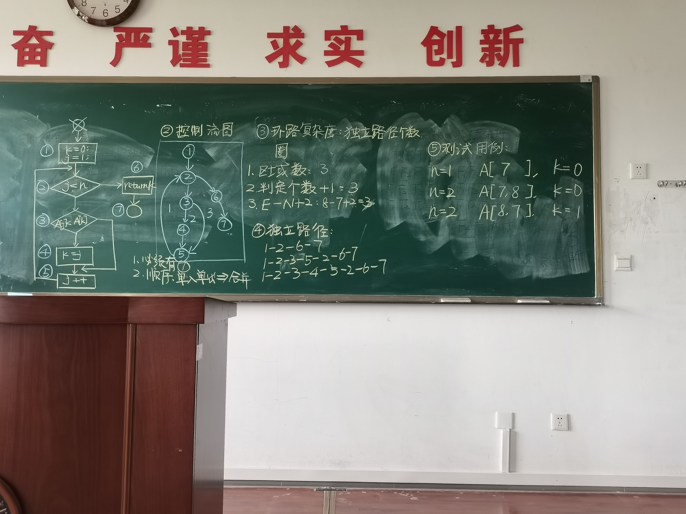

# Softwareengineering
软工期末复习Software engineering

## 考试题型
1. 选择 10*1
2. 填空 20*1
3. 名词解释 5*2（RTM：需求跟踪矩阵）不用解释，只要翻译出来汉语即可
4. 应用题 4题：4分、12分、4分、4分 
5. 画图题：12分（画两个图）   8分(带简答）

两个12分大题中有一个是给一段代码（两重for循环），画出程序控制流图、还有一个图、算环路复杂度

二四五六分多，重要

第一章  1.8及以后不考

第二章  过程模型特点优缺点，选填名词解释

第三章  不考画WBS，但是要看
里程碑、关键路径、甘特图知到即可，不用画
人之间的沟通渠道
effort、risk
3.5往后不考

第四章 都得知道  相关图和文档 4.6、4.11不考

第五章 啥叫设计、质量属性、performance性能及其度量
5.6、7/8/9不考

第六章 设计原则、设计过程（设计模式不考）
6.3不考   6.4的图要会画

第七章  有一个大题  写代码要注意啥、写代码这个阶段的输出、注释类型（）
7.1、2、3、4

第八章   什么是测试、测试对象、测试阶段、测试过程
单元测试常用方法（简答）、集成测试相关笔记
8.7往后不考

第九章   需要测哪些功能、哪些性能
因果图、状态基不考
条件覆盖要看看

第十章   交付时的文档、谁交付

## 名词解释：
- SRS  软件需求规格说明书   Software Requirements specifications
- SRD  软件需求定义说明书  Software Requirements definition
- COTS  商用现成品或技术 Commercial Off-The-Shelf
- UML  统一建模语言  Unified Modeling Language
- CPM  关键路径法  Critical Path Method
- CCB  变更控制委员会 Change Control Board
- WBS  工作分解结构  Work Breakdown Structure
- CMM  能⼒成熟度模型（Capability Maturity Model) 
- CMMI  能⼒成熟度集成模型（I指的是integration 集成) 
- SPICE  软件过程提升和能⼒评价 
- ROI  投资回报率（return on investment投资） 
- RTM  需求跟踪矩阵 Requirement Trace Matrix
- Gantt chart  甘特图
- effort estimation  工作量估计
- CBSE  基于构件的软件工程（component-based software engineering)

## 第一章：
1. 软件特征:
    - 抽象(abstract)：是一种抽象的逻辑实体(logic entity)，而不是一个物理实体。
    - 软件不会磨损(wear out)
    - 软件是可移植的(portable)
    - 软件依赖于硬件(hardware)和操作系统(operating systems)
    - 软件是开发(develop)出来的，而不是制造(manufacture)出来的
    - 软件是定制的(custmized)(强调用户个性化的需求)
2. 软件(software)=数据(data)+程序(code）+文档
3. 如何⽤软件⼯程解决问题 
    - 分解问题（analyze）：将⼤的问题分解成易于理解、可以尝试解决的多个⼩问题。 
    - 合成问题(synthesis）：将⼤问题的各个⼩的组成部分的解结合构成⼤问题的解。 
6. 软件⼯程三要素： 
    - ⽅法（method）、⼯具（tool）、过程（process） 
7. 评价软件质量的的三种⽅法 
    - 产品（product）本身的质量 
    - 过程（process）的质量（公司中QA检测）（QA质量保证，QC质量控制） 
    - 商业环境中产品的质量 
8. 故障（fault）：内部的错误 
    - 错误（error）：编码过程中的错误 
    - 失效（failure）：和⽤户的需求不⼀致
    - （编码的错误引起内部的故障，进⽽导致⽤户看到的失效。
9. stakeholder（相关⽅）⼲系⼈ 
10. 质量模型和过程模型 
    - CMM能⼒成熟度模型（Capability Maturity Model) 
    - CMMI能⼒成熟度集成模型（I指的是integration 集成) 
    - SPICE软件过程提升和能⼒评价 
    - ROI投资回报率（return on investment投资） 
11. 客户（Customer）：为软件系统⽀付的公司、组织或⼈（通常是项⽬发起⼈sponsor） （stakeholder） 
    - 开发⼈员（Developer）：开发软件系统的公司、组织或⼈ 
    - ⽤户（User）：实际使⽤系统的⼈ （⼀定包含管理员）(需求来源者） 
12. 开发⼀个系统 
    - 需求分析与定义（requirement analysis and definition） 
    - 系统设计（概要设计）（架构）（system design） 
    - 程序设计（详细设计）（算法）（program design) 
    - 写程序（writing the programs）（软件实践的过程） 
    - 单元测试（每个函数单独测试）（unit testing） 
    - 集成测试（两函数间接⼝测试）（interface）（内部接⼝：函数的参数；外部参数：界⾯，即⽤户 和系统、⽹络间的接 ⼝）（单元测试和集成测试是判断正确性的） 
    - 系统测试（system testing)（测试是否符合⽤户需求） 
    - 系统交付（system delivery）（主要是培训） 
    - 维护（maintenance）（⾛整个系统开发的流程） 
⽤户系统使⽤发现bug，⾸先进⾏系统测试，再从需求分析开始往下

## 第二章：过程模型和生命周期
1. 过程（process）：⼀系列与活动、约束和资源相关的步骤 
2. 瀑布模型（waterfall model）：
    - 优点：顺序执行（线性模型），易于管理（每个阶段都有明确的可交付成果和里程碑），可帮助项目经理熟悉项目流程
    - 缺点：不易于项目变更，没有迭代（no iteration），需求阶段的错误最后才可以发现
    - 适用：需求明确且稳定，开发周期长，比较熟悉的项目
3. 原型化（prototyping/rapid model）
    - 优点：可降低风险，主要用于需求分析，是其他模型在需求分析阶段的辅助手段
    - 缺点：不适用于大量运算与逻辑推理的系统
    - 适用：需求不确定或部分确定的系统
4. V&V：
    - Validation（确认）(确认结果的准确性，即功能是否满⾜⽤户的需求） 
    - Verification（验证）（验证过程的正确性） 
5. V模型
    - 不同的测试开始于不同的阶段，制定测试计划标志着测试的开始。 
6. 阶段化开发模型（Phased Development Model ）
    - 类型：
      - 增量开发(Increments)（⼀开始实现⼀部分功能，后续版本再分别实现其它功能） 
      - 迭代开发(Iterations)（⼀开始就实现所有功能，后续版本对第⼀版的功能进⾏改善升级） 
    - 现实中增量开发和迭代开发⼀般都是同时出现的 
    - 优点：
      - 缩短开发时间，快速投⼊使⽤，抢占市场 
      - 可以尽早发现并维护在实际使⽤中的问题 
      - 在不同的阶段专注于不同的领域 
      - 尽早交付和培训 
7. 螺旋模型（Spiral Model）
    - 唯⼀和⻛险控制结合的模型 
    - ⼀圈是⼀个⽣命周期（由内⽽外） 
    - 适合⾼⻛险的 
    - alternative 可替代的，替代物 
12. 敏捷⽅法（Agile Methods） 
    - 测试最早可以与需求分析同时开始（甚⾄早于需求分析）
    - 特点
      - 测试驱动的需求分析（测试早于需求） 
      - 不关注于过程⽂档，只关注核⼼⽂档 
      - 适⽤
        - 没有强制性约束的 
    - 每⽇站⽴会议（daily stand up meeting)(敏捷性） 
    - 2-4周⼀个迭代，每个迭代就交付 
    - ⼩团队，⼀般不超过⼗个⼈ 
    - 需求不明确 
    - XP（extreme programming）极限编程 
    - pair programming结对编程 不能质疑队友操作习惯，两个⼈必须同时到场效率⾼ 

## 第三章：计划和管理项目
1. 里程碑 milestone：标志着一个活动的开始和结束
2. 甘特图（Gantt chart）又称为横道图、条状图(Bar chart)。其通过条状图来显示项目、进度和其他时间相关的系统进展的内在关系随着时间进展的情况。
3. 工作分解结构（Work Breakdown Structure, WBS）：以可交付成果为导向对项目要素进行的分组，它归纳和定义了项目的整个工作范围每下降一层代表对项目工作的更详细定义。
4. 关键路径（critical path）是指设计中从输入到输出经过的延时最长的逻辑路径。
5. 工作量估计 effort estimation
6. 有效沟通路径(n-1)n/2 

## 第四章：获取需求
1. 需求的定义(IEEE)(三方面）
    - 用户   
    - 系统
    - 文档化
2. 需求的分类
    - 功能需求：系统需要完成的用户对功能的期望
    - 质量需求（性能需求performance、非功能需求）：对功能需求的一些性能进行量化
    - 质量需求必须要有量化指标
    - 设计约束：平台和接口组件选择
    - 过程约束：过程模型
3. 需求的优先级划分
    - 必须的essential
    - 期望的desirable
    - 可选的optional
4. 需求的特点（需求评审时满足下述特点才是需求）
    - 正确性(correct)、一致性(consistent)、无二义性(unambiguous)、完整性(complete)
    - 可行性(feasible)、相关性(revelant)、可测试性（可度量性）(testable/measurable)、可跟踪性	(traceable)
5. 需求开发的过程
    - 需求获取(elicitation)、需求分析和建模(analysis and modeling)、编写需求规格说明				(specification)、有效性确认(即需求评审)(validation)
    - 需求开发是一个迭代的过程
    - 通过需求评审标志着需求开发过程的结束（输出SRS）（software requirements 				specifications）（软件需求规格说明书）
6. 需求定义说明书Requirements definition	来自用户
    - 需求规格说明书Requirements specifications	给开发团队看的
    - 一个需求在整个生命周期中要有跟踪性（向上追溯到用户，向下追求到开发团队）
7. 需求获取中的干系人(stakeholders)
    - 顾客clients（可以不管）
    - 客户customers（为软件开发支付的人）
    - 用户users（使用软件的人）
    - 领域专家domain experts
    - 市场调研人员market researchers
    - 法务或审计lawyers or auditors
    - 软件工程师software engineers
8. 需求获取的方法
    - 观察用户的操作
    - 查阅有价值的文档
    - 观察现有的系统
    - 采访用户或小组里的干系人
    - 使用领域特定的方法，如联合应用开发
    - 头脑风暴
9. 原型法（获取需求）
    - 抛弃型（抛弃需求）
    - 衍化型（在最先的基础上继续迭代）
    - 适合小型的、简单的、处理过程明确的、没有大量运算和逻辑处理过程的系统
    - （MATLAB不适合使用原型法获取需求，需求稳定且明确）
    - （原型法适合需求不明确的）
10. 设计人员、测试人员、维护人员会看需求规格说明书（SRS）
    - 需求规格说明书通常会作为合同的一部分，一旦起纠纷，具有法律效益
11. 需求跟踪矩阵RTM
    - 表中内容向后可延伸，向前可跟踪
12. 用例图  外部视图、静态视图
    - include包含关系，表示完成虚线端的用例必须完成箭头端的用例
    - extend扩展关系，表示完成虚线端的用例可能会完成箭头端的用例
13. UML类图 内部视图、静态视图
    - 组合composition：实心菱形，耦合度高
    - 聚合aggregation：空心菱形，耦合度低
    - 关联association：一条直线，表明类之间的关系
14. 时序图  外部视图、动态视图
15. 状态机图  内部视图、动态视图
16. 需求分析阶段涉及的图：ER图、UML类图、UML状态图、状态机、事件跟踪图、消息时序图、Petri图、数据流图、用例图

## 第五章：架构设计
5.1-5.3
1. 软件体系结构的开发过程：建模、分析、文档化、评审，最终生成概要设计说明书和详细设计说明书
2. 常见的设计方法：按功能、特性、数据、处理过程、事件、对象六个方面拆分
3. 软件单元：构件component、子系统subsystem、运行时例程runtime process、模块module、类class、包package、库library、过程procedure
4. 一个定义明确的软件单元的接口必须能够准确无误地描述该单元的外部可见行为
5. 设计：复用和改进当前已有设计风格、参考模型、设计模式，满足用户规定的所有需求，达到质量属性和设计原则

概要设计：采用、参考、修改现有的体系结构风格，遵守基本设计模式、设计惯例、设计原则，采用按功能拆分、按特性拆分、按数据拆分、按处理过程拆分、按事件拆分、按照对象拆分的分解方式，将目标系统分解为不同子系统、构件、组件、模块、单元等，并定义他们之间的关系（上下层，调用关系等），最终构成了我们的体系结构。

5.4
1. 管道过滤器(pipes and filter)
优点：易扩展，易修改，易交换，易复用（相互独立)
缺点：容易成为批处理结构，不易交互；
    过滤器间相互独立，传输过程中需要编码和解码，给系统带来负荷，增加了它的复杂度
使用体系：Linux操作系统、传统编译器
2. 客户端服务器（client-server)（CS）和浏览器服务器（browser-server)（BS）
是分布式，系统由客户端、服务器、网络构成（摧毁分布式系统只能摧毁网络）
分为三层：数据库服务器、应用处理服务器、客户端（数据库和应用处理两个服务器要隔离开，确保安全性）
优点：客户端和服务器相互独立，互不影响（独立性）；易扩展；易修改；易复用（相互独立)
缺点：由于CPU性能、网络速度等，导致单一服务器能同时服务的客户端数量有限，当有大量客户端同时发出请求时，服务器容易阻塞。
使用最多，如微信、支付宝
3. 对等网络(peer-to-peer)(p2p)
每个组成部分既是服务器，又是客户端
解决CS、BS缺点
如下载器（迅雷）、文件处理器、即时通讯软件（QQ、微信）、网络电视、直播
优点：易扩展；易修改；易复用（相互独立)；提高系统性能；高容错率；
缺点：安全性差（每个设备都作为节点，别的节点设备可以拉取该节点信息，安全有待商榷）
4. 发布-订阅（publish-subscribe）
是一种隐式调用（类似于javafx事件驱动编程，需要等待事件发生才能调用）
如新闻订阅、微博关注（关注该用户后，只有用户发布新消息才能收到推送信息）
优点：易扩展，易修改，易定制，易复用
缺点：难测试（有些事件不易模拟，数据收集难）
5. 仓库（repositories）：风格数据库、超文本系统、黑板
数据库：
优点：多个客户端可以共享数据，可复用，易扩展
缺点：安全（必须有备份数据库）
涉及数据共享，要加锁（避免两个用户同时对数据库同一位置进行写操作）
黑板：中央数据结构（及数据库）的当前状态触发系统相应的进程执行
机器翻译、语音识别、现代编译器用的都是黑板结构
优点：开放性
6. 分层（layering）
优点：高度复用、易修改、易扩展
缺点：很难确定系统分为几层合适
7. 现行应用可能大都会结合多种体系分格设计系统结构

5.5质量属性
1. 可修改性（适应变更）： 要能提前预期到可能的变更，提高泛化性，高内聚低耦合，接口简单
2. 性能：
响应时间、吞吐量、负载、速度、系统资源占用率、并发用户个数
3. 安全性（security）：软件运行不引起系统事故的能力
免疫力（immunity）：抵御非法操作的能力
恢复力（resilience）：受到攻击回复的快速性和容易性
4. 可靠性（reliability）
5. 易用性（usability）
外行型、熟练型、专家型
6. 鲁棒性（robustness）
健壮性、稳定性
1. 耦合（coupling）描述模块间独立性
2. 内聚（cohesion）描述模块内部的属性
3. 一般设计都要遵守高内聚低耦合（loosely coupling）（有些情况必须使用耦合，故只能尽可能使用低耦合，而不是无耦合）

## 第六章：模块设计
6.1设计方法
1. 在概要设计和模块设计（详细设计）间没有明显的分界线
2. refactoring 重构：周期性的重审和修改概要设计模块，详细设计阶段发现概要设计出问题，进行修改（再访问）

6.2设计原则
1. 模块化：高内聚、低耦合 high cohesion loose coupling
2. 接口隔离：
内部接口：模块间的参数列表
外部接口：系统和用户、操作系统、数据库、硬件之间的接口
可以描述模块的耦合度
3. 信息隐藏（即封装） information hiding
尽可能少地暴露接口
4. 增量开发 incremental development
要明确各模块间的调用图（use graph）
扇入：其他模块调用该模块
扇出：该模块调用其他模块
fan-in、fan-out
设计要高扇入、低扇出
若调用图成环，将一个模块拆成两个，将环状拆开
5. 抽象
过程抽象（算法设计）和数据抽象（数据结构）
6. 泛化性 generality
简化接口、前置条件等
7. 用例图只用于需求分析，其他图既可用于设计，也可用于架构

## 第七章：程序编写
1. 编码过程 the programing process
代码设计、代码审查、代码编写、代码编译、单元测试、代码调试
2. 编码阶段的输出：源代码、目标程序、用户指南
3. 编码时应该注意的地方：
变量命名要有意义，不要随意取名
采用统一的变量命名规则，如驼峰命名法
在代码中加入适当注释，提高代码可读性
不要一味追求高性能的算法，可能会增加后续代码维护的困难
采用高内聚、低耦合的模块化设计原则
4、注释annotation类型：头部注释和功能性注释

## 第八章：程序测试
1. 由独立的测试小组执行测试
2. 黑盒测试 closed box or black box
3. 白盒测试：语句覆盖statement coverage、判定覆盖Desicion Coverage、条件覆盖Condition Coverage、条件判定覆盖Conditional decision coverage、条件组合覆盖、路径覆盖
4. 单元测试方法 unit testing
静态测试：代码走查 code walkthrough、代码审查 code inspection、同行评审 peer view
动态测试：白盒测试、黑盒测试
5. 集成测试 integration testing
不采用静态测试，进行灰盒测试（白盒）、黑盒测试
驱动模块component driver：
桩模块stub：
编写桩模块的工作量比编写驱动模块的工作量大
集成策略：
自底向上bottom up：编写桩模块的工作量小，底层模块能被较早验证，但是高层验证被推迟了，设计上的问题会被较晚发现
自顶向下top down（可采用广度优先或深度优先）：与上述相反 
大爆炸（一次性集成）（big bang）：既不用写桩模块，也不用写驱动模块，工作量小，但是集成效率低，并行度最高
三明治（sandwich）：将自顶向下、自底向上结合，中间层的界定不好确定，编写桩模块的工作量比自顶向下的小，编写驱动模块的工作量比自底向上的少
6. 测试对象
之前各个阶段的所有工作制品包括目标程序、源程序、文档等
7. 测试过程
确定测试目标、设计测试用例、编写测试用例、测试测试用例、执行测试用例、评估测试结果

## 第九章：系统测试
1. 软件可靠性reliable：指一个系统对于给定的时间间隔，在给定条件下无失效运行的概率
2. 软件可用性availability：在给定时间点通过需求规格说明书成功操作
3. 软件可维护性maintainability：在给定的条件下，在规定时间间隔内，使用规定的过程和资源完成维护活动的概率
4. 上边三种性能的度量
平均无故障时间MTTF，mean time to failure
平均失效间隔时间MTBF，mean time between failures
平均修复时间MTTR，mean time to repair
MTBF=MTTF+MTTR
可靠性测量  R=MTTF/(1+MTTF)
可用性测试  A=MTBF/(1+MTBF)
可维护性测试M=1/（1+MTTR）
5. 验收性测试种类
试验性测试 pilot test：小规模测试
Alpha test：在项目开发环境下，由项目团队中的成员辅助用户/客户测试
Beta test：不在项目开发环境下，由用户自己测，不需要项目团队成员辅助
Parallel test：并行测试：新系统和旧系统同时运行一段时间

## 第十章：交付系统
1. 系统交付包括培训和文档化
2. 培训方式：
文档、图标和线上帮助、培训会、培养专业的用户
3. 文档类型：
	用户手册、操作员手册、系统概览、指南和自动化纵览、程序员手册

## 第十一章：维护
1. 维护类型：改正性维护（corrective）、适应性维护（adaptive）、完善性维护（prefective）、预防性维护（preventive）
2. S-system：系统需求及解决方案不易于变更，如数学、物理、化学等基本运算（例如矩阵计算、MATLAB等）（问题和解决方案稳定不变）
3. P-system：系统需求本质上不会改变，但是解决方案会发生变更（如下象棋，规则不会发生变化，但是解决方案可以是人也可以用算法）
4. E-system：系统需求及解决方案都会发生变更（如税务系统、微博、微信）